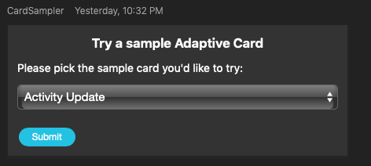
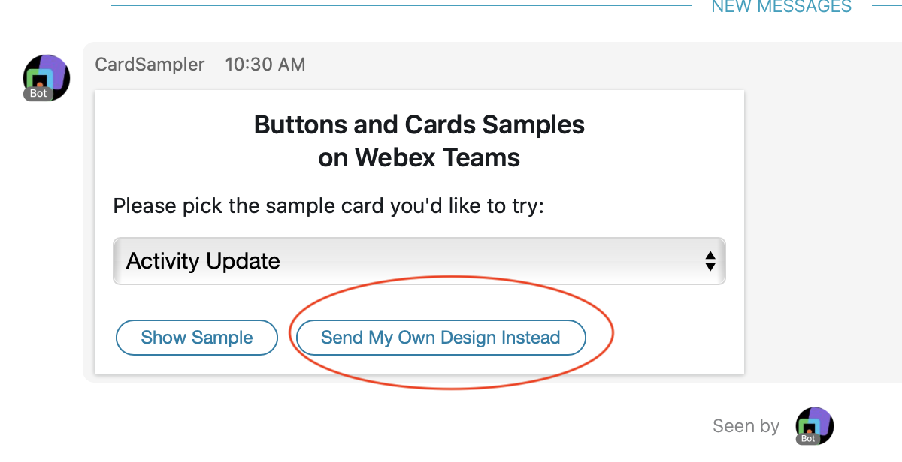
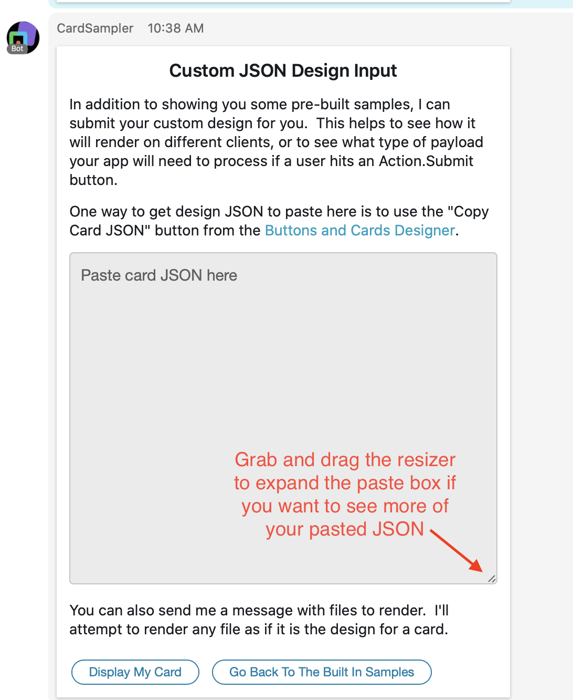
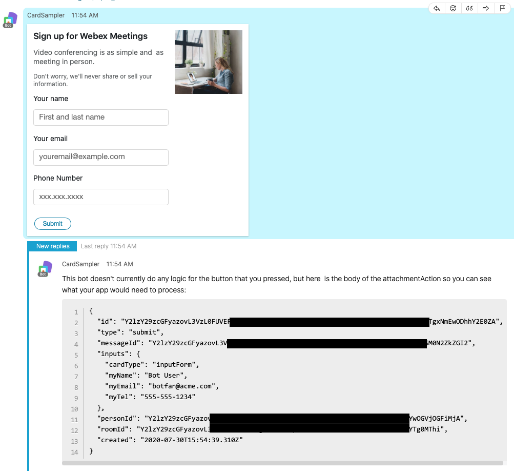

# webex-card-sampler
This is a Webex Teams bot that helps bot developers and designers learn what is possible with the [Buttons and Cards](https://[adaptivecards.io/samples/](https://developer.webex.com/docs/api/guides/cards)) functionality of Webex Teams.  The bot allows users to experience a set of sample cards which demonstrate how cards can be used to display and collect complex information across a variety of use cases.   User's who create a space with the bot are presented with a drop down list in order to select the sample card they want to interact with.



Each time a sample is displayed, the bot provides a link to the card's source in the [Buttons and Cards Designer](https://developer.webex.com/buttons-and-cards-designer), so that developers and designers can modify it to suit their own needs.

For designers who are creating their own cards, the Buttons and Cards Designer does a great job of showing you what your card will look like in the Webex Teams Web client, but it might look a little bit different when it renders in the Mac, Windows, or Mobile clients.  Ideally, you would test your design in each of the clients that users of your app will be using. Card Sampler makes it easy to try this. On the main "selection" card you will see a button "Send my own JSON Instead":



If you click this, you will get a card that allows you to paste your JSON onto a card and the bot will post your card for you. (It's worth noting that you can also just send the bot a message with a file attachment and it will try to post that as well). If the card design fails to render, the bot will provide you the details of the error message returned by the Webex API call which you can use to tweak your design.




Getting the look and feel of your card is important, but if your card includes any `Action.Submit` buttons, it's also important to understand the data that will be sent back to your application for processing.  Getting this nailed down in the design phase will make it much easier when it's time to implement the button press handlers in your application code. 

As a rule an `Action.Submit` button press is going to pass back any information collected in any `Input` elements in your card, as well as any additional info that you specify in the `data` attribute of the `Action.Submit` element itself. It's not always obvious what the payload of that `attachmentAction` is going to look like when designing the JSON, but here again the Card Sampler bot can help. Using the methods described above, have the bot post your custom design. If it renders successfully go ahead and fill in any input fields and/or click on buttons. The bot will send the full body of the `attachmentAction` that was sent to the app in response to the button click which will allow you to make sure that you are capturing everything you need to, and to document what the key/value pairs are that the app developer should expect.




If you are ready to start interact with Card Sampler simply add CardSampler@webex.bot to a teams space, and say hello to the bot.   To discuss Buttons and Cards with other developers join the conversation in the [Buttons and Cards Developer Space](https://eurl.io/#SJiS9VKTH) on Webex Teams.

## Running your own copy of the bot
If you aren't familiar with creating Webex bots in general but want to create one that uses Buttons and Cards, there are a series of blog posts that can help you get started:

* [From Zero to Webex Teams Chatbot in 15 Minutes](https://developer.webex.com/blog/from-zero-to-webex-teams-chatbot-in-15-minutes)
* [Introducing the Webex Bot Framework for Node.js](https://developer.webex.com/blog/introducing-the-webex-teams-bot-framework-for-node-js)
* [A Deeper Dive into the Webex Bot Framework](https://developer.webex.com/blog/a-deeper-dive-into-the-webex-bot-framework-for-node-js)
* [Five Tips for Well Behaved Bots](https://developer.webex.com/blog/five-tips-for-well-behaved-webex-bots)

This bot does introduce some additional concepts (such as how to process a "Sample Picker") that you might also find handy depending on your bot logic.  If you are already familiar with the basics of building and running a Webex bot, it might be useful run this bot locally to better understand it. 

The following is a checklist to run your own copy of this bot.

Prerequisites:

- [ ] node.js (minimum supported v8.15.1 ) and npm (node package manager)

- [ ] Sign up for Webex Teams (logged in with your web browser)

- [ ] Fork and download this project
----

- [ ] Create a Webex Teams Bot (save the email address and API key): https://developer.webex.com/add-bot.html

- [ ] In the directory where you downloaded this project, download the dependencies by typing `npm install` 

## Starting the server

Set the following environment variables, for example in a .env file, or however you set them in your run time environment:
* TOKEN - the token that you got when you created your bot at https://developer.webex.com/add-bot.html
* PORT - the port where your app is running.  This is typically needed when running locally, and set automatically when running in a production environment.

Optional:
* ADMIN_EMAIL - if set the bot will post messages to the 1-1 space with this user (usually the app's developer), when the bot is added to new spaces.

Start your node server in your environment.  This can be done via a debugger when running locally, or by entering the following:
    ```npm start```

## Using your local copy of the bot

Once the server is up and running Webex Teams users can add the bot to a teams space.   Add the bot to a space by inviting it via the email address you used when you created your bot.

Any message will generate a "selection" card with a drop down list of samples to try.   


## Implementation details

Webex Buttons and Cards functionality is best described in the [Buttons and Cards Developers Guide](https://developer.webex.com/docs/api/guides/cards).  In a nutshell, a bot must [POST requests to the Webex /messages API](https://developer.webex.com/docs/api/v1/messages/create-a-message) with a request body that contains an attachment attribute with information about the card being posted.   If the card contains a button with the Action.Submit type, this will generate an attachmentAction:created event when a user in the space clicks that button on the card.  In order to be notified of attachmentAction events, an application must register for a [webhook](https://developer.webex.com/docs/api/guides/webhooks) associated with the attachmentAction resource.   Once an attachmentAction webhook is received, the application  can [query the Webex /attachments attchments API](https://developer.webex.com/docs/api/v1/attachment-actions/get-attachment-action-details) to get the decrypted data associated with the card action.

For developers who are familiar with Webex webhooks, it is worth pointing out that attachmentAction:created events are NOT delivered when you register the "firehose" webhook by setting both the  `resource` and `event` attributes of your POST /webhooks request to "all".  You must explicity register for a second webhook with the `resource` attribute set to "attachmentActions" and the `event` attribute to "created".  You may, of course, use the same `targetUrl` for both webhooks.

This bot's implementatation leverages the [webex-node-bot-framework](https://github.com/jpjpjp/webex-node-bot-framework) which abstracts away some of this complexity.  It automatically registers the attachmentAction (and all messaging related) webhooks, and gets the decrypted data before emitting an `attacmentAction` event. The framework also creates a `bot` object for each space, that our bot is a part of which allows the developer to call convenience functions such as `bot.say()`, `bot.sendCard()`, and `bot.reply()` which abstract away some of the complexities for calling the Webex RESTful APIs from a node.js based application.   Note that the [Webex For Developers blog posts](#running-your-own-copy-of-the-bot) referenced above provide a great overview of the framework in general.

This application implements a [framework.hears(/.*/,...)](https://github.com/jpjpjp/webex-card-sampler/blob/56e51548ee7e6ac229837a9d18b2b0180ceff9a6/server.js#L203) method which is called anytime a user posts a message to our bot. In response to this message our bot will post our [sample-picker](./res/design/sample_picker.json) card. 

When a user clicks the "Submit" button our [framework.on('attachmentAction, ...)](https://github.com/jpjpjp/webex-card-sampler/blob/56e51548ee7e6ac229837a9d18b2b0180ceff9a6/server.js#L227) method is called and we process the information from the card to choose the next card to render.

The logic for each card that our sampler can render is encapsulated the appropriate file in the [res](./res) directory.   Each card file contains the following:
* A comment with a link to the card source in the Buttons and Cards Designer
* An object that contains
  * A `card` object with the card's JSON design schema 
  * A `renderCard` function to displays the card using the `bot.sendCard()` function.
  * If appropriate, a `handleSubmit` function to send messages back to the Webex Teams space about the payload that was provided when a user hit a button, using the `bot.reply()` function.  

Note that some information about the card itself is also presented along with a link to the source so a developer can learn more about the JSON design object that make up a card.

Finally, if the card contains a submit button, the `flint.on(attachmentAction,...)` method is called.   The logic here inspects the `attachmentAction.inputs.cardType` attribute which is included in all the cards in our sample, and based on the card type calls the appropriate `handleSumbit` method which will post a message with any card specific information that was aquired by the application.

Thanks for trying the Card Sampler.  Feel free to open an issue on this project if you find a problem, or join the conversation with other developers in [Buttons and Cards Developer Space](https://eurl.io/#SJiS9VKTH) on Webex Teams.

Most of all: Have fun!

